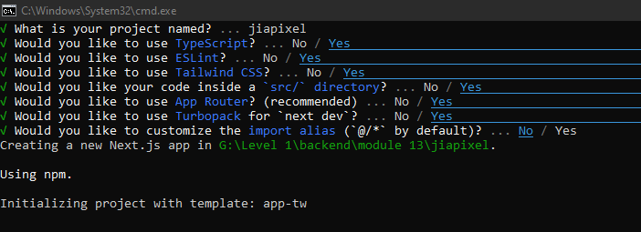

# Next Js core concept

- Visit official Documentation [https://nextjs.org/](https://nextjs.org/)
- run the code in terminal
```
npx create-next-app@latest
```
- ***Follow the steps from the image***



- Run the app
```
npm run dev
```
- make change in page.js to check if it is working
- visit [Nextjs Documentation](https://nextjs.org/docs/app/getting-started/project-structure)
- select `using app router` > `Project Structure`
- create `components`
```
📦src
 ┗ 📂app
 ┃ ┣ 📂components
 ┃ ┃ ┗ 📜Navbar.tsx

```
- add `navbar` and `footer` at layout 
- create main section for `children` and add classname h-screen
- create component folder for add component footer, navbar
- follow [pages and layout documentation](https://nextjs.org/docs/app/getting-started/layouts-and-pages)
- To create new page create new folder and file in `app` folder
```
📦app
 ┣ 📂components
 ┃ ┣ 📜Footer.tsx
 ┃ ┗ 📜Navbar.tsx
 ┣ 📂Services
 ┃ ┗ 📜page.tsx

 ```
 - For Nested route follow the same instruction as new route in nested route